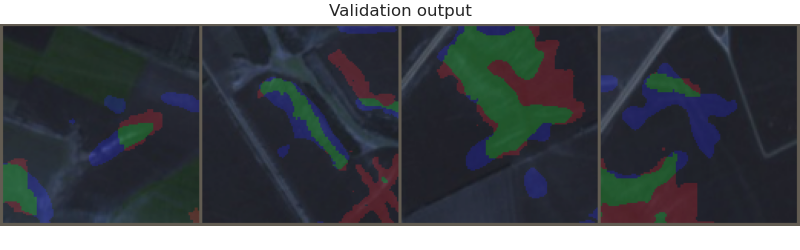
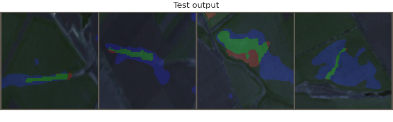
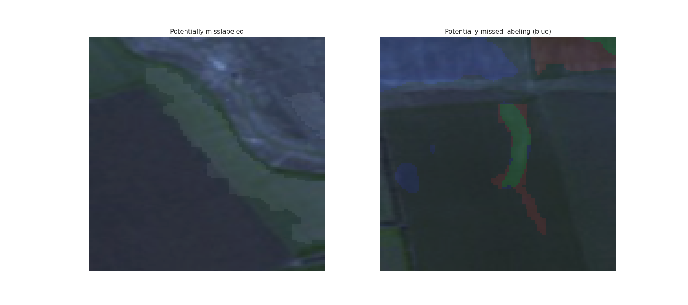

# Soil erosion segmentation

<div id="header" align="center">
  
</div>


## Introduction

Soil erosion is a significant environmental problem that can have severe consequences, including reduced agricultural productivity, degraded water quality, and increased flooding. This project aims to provide a solution to the problem of soil erosion by detecting and segmenting the areas of soil affected by erosion in satellite imagery. By accurately identifying the areas of soil erosion, this model can help inform and guide the work of relevant specialists in mitigating the effects of erosion and preserving the health of our ecosystems.


## Final Model Architecture and Training

To detect and segment areas of soil erosion in satellite imagery, I experimented with several different model architectures and training techniques. I tried out a range of models, including DeepLabV3, DeepLabV3+, FPN, and PSPnet, as well as different backbones for these models, such as EfficientNet, ResNet, VGG, and Mix Visual Transformer families. Through experimentation, we found that the standard UNet architecture with an EfficientNet backbone provided the best results for our soil erosion detection task.

In addition to testing different model architectures, I also experimented with several loss functions, including BinaryCrossEntropy, Jaccard Loss, and Dice Loss, with some optimizers Adam, Adamw, RAdam, NAdam, and RMSprop and some standart Learning Rate Schedulers.

### Final Model
| Model Architecture | Encoder name | Encoder Depth | Features Maps       | Input Size | Pretrained | Loss               | Optimizer | LR Scheduler                       |
|--------------------|--------------|---------------|---------------------|------------|------------|--------------------|-----------|------------------------------------|
| UNet               |efficientnet-b5 | 3             | [512, 256, 128]     | 128x128    | Imagenet   | BCEWithLogitsLoss | AdamW     | CosineAnnealingWarmupRestarts (custom)      |

### Results
| Subset | IoU Score|
|--------|----------|
| Train  |    41%   |
| Valid  |    36%   |
|  Test  |    25%   |




The predicted masks were color-coded to highlight areas where the model correctly identified erosion (green), incorrectly identified erosion where it did not exist (blue), and missed erosion (red). This visualization allowed us to easily identify areas where the model performed well and areas that require further improvement.


## Dataset

To ensure the dataset used for training was of high quality and diverse enough to prevent overfitting, I utilized several preprocessing techniques, including:

- Our data consisted of 10900x10900 satellite image and corresponding mask for eroised soil.
- To create dataset, I initially cropped the images into smaller 244x244 images with a 244-step and resized them to 256.
- We did not save cropped images if the corresponding mask did not include elements to segment, because most images having very little useful information only on the edges.
- After that to improve the quality of the masks, I cut off each individual element of the mask by padding its range to 156 pixels.
- I further diversified the dataset by introducing a shifting sliding box of size 10 to 30 pixels from the center of the image to prevent overfitting.
- To prevent overfitting, we applied various data augmentation techniques during training, such as random rotations, flips, brightness and contrast adjustments, and elastic transformations.
- Data augmentation played a critical role in improving our model's performance and reducing overfitting, resulting in a more robust model that was able to generalize better to new data.

## Installation and Usage

 To use this project, you can follow these steps:

1. Clone the repository to your local machine using git clone `https://github.com/kafkaGen/Soil_erosion`.

2. Navigate to the repository directory using `cd Soil_erosion`.

3. Install the required packages using `pip install -r requirements.txt`.

4. Run the `erosionSegment.py` file with the desired hyperparameters. You can specify the hyperparameters in the command line arguments, for example: <br>
`python erosionSegment.py --epochs 10 --learning_rate 0.001`

The available hyperparameters are:

- **--max_lr**: First cycle's max learning rate (default: 1e-3)
- **--min_lr**: Min learning rate (default: 3e-4)
- **--first_cycle_steps**: First cycle step size (default: 25)
- **--cycle_mult**: Cycle steps magnification (default: 0.85)
- **--warmup_steps**: Linear warmup step size (default: 8)
- **--gamma**: Decrease rate of max learning rate by cycle (default: 0.75)
- **--pos_weight**: a weight of positive examples (default: 7)
- **--max_epochs**: number of training epochs (default: 70)
- **--model_name**: model name to save best checkpoint (default: model)

> Note that if a hyperparameter is not specified, the default value will be used.

5. Wait for the model training to complete, which may take some time depending on your hardware.

6. Once the model has finished training, you can find the best checkpoint in `models` dir and use it to make predictions on new data.

That's it! With these steps, you should be able to train and use the this solution for your own purposes.

## Files and Directories


```
.
├── data                  - train/ valid/ test storage
├── masks                 - satellite image and masks file storage
├── models                - place for best models storage 
├── settings              - configuration folder
│   └── config.py         - configuration file with model hyperparameters
├── tb_logs               - place for model logs storage
├── utils                 - src folder
│   ├── __init__.py       - init file with other helpful functions
│   ├──  dataset.py       - pytorch dataset inplementation
│   ├── lightning.py      - pytorch lightning modules
│   └── train.py          - pytorch training loop functionality
├── erosionSegment.py     - CLI for model training
├── README.md
├── requirements.txt
└── soil.ipynb            - data and model exploration
```

## Further Improvements

### Dataset issues 

It is important to acknowledge that the quality of the dataset used for training a machine learning model can have a significant impact on its performance. While efforts have been made to ensure the accuracy of the labeled masks for soil erosion, there is still a possibility of errors. It is possible that some areas may be incorrectly labeled as exhibiting erosion or that some areas with erosion may have been missed in the labeling process. Demonstrating the following examples, I want to say that they are far from isolated:



To mitigate these issues, it is essential to have an expert (*because I'm not sure it's appropriate for me to remove or add new masks without competence in this area*) in the field of soil erosion review and validate the dataset for accuracy. This expert can provide valuable insights and ensure that the dataset is properly labeled to improve the performance of the model.

For instance, if an area is incorrectly labeled as eroded soil when it is not, the model may learn to identify features that are not actually indicative of erosion, leading to false positives. On the other hand, if an area of erosion is not labeled, the model may not learn to identify and segment that area, leading to false negatives. These errors can significantly reduce the performance of the model and limit its practical applications.


Although the current satellite imagery that we have for our soil erosion model is limited to only RGB channels, it's important to note that there are several other types of imagery that can greatly enhance the model's performance. Some examples include Near-Infrared (NIR), Thermal Infrared (TIR), and Slope, to name a few. Incorporating these additional channels can provide a more detailed view of the terrain and help identify areas of erosion more accurately. It's something to consider for future iterations of the model.

### Architecture improvements

The paper [Panoptic Segmentation of Satellite Image Time Series with Convolutional Temporal Attention Networks](https://paperswithcode.com/paper/panoptic-segmentation-of-satellite-image-time) presents a promising approach for panoptic segmentation using their own model, U-TAE, with Spatio-temporal Encoding technique. Although it differs from our task, we can still utilize their pretrained model as it was trained on the same type of data as ours.

Similarly, in the research paper [Satellite Image Semantic Segmentation](https://paperswithcode.com/paper/satellite-image-semantic-segmentation), the researchers used UPerNet model with Swin Transformer backbone. We can also consider using their pretrained model, particularly since they provide all their data preprocessing steps.

If there is no opportunity to influence our dataset, we can use a combination of our dataset, [GID (Gaofen Image Dataset)](https://paperswithcode.com/dataset/gid) and one used in [Satellite Image Semantic Segmentation](https://paperswithcode.com/paper/satellite-image-semantic-segmentation) to create an Autoencoder, then pretrain our encoder to solve this type of problem.


For better Unet understanding I used:
- [U-Net: Convolutional Networks for Biomedical Image Segmentation](https://paperswithcode.com/paper/u-net-convolutional-networks-for-biomedical)
- [UNet++: A Nested U-Net Architecture for Medical Image Segmentation](https://paperswithcode.com/method/unet)